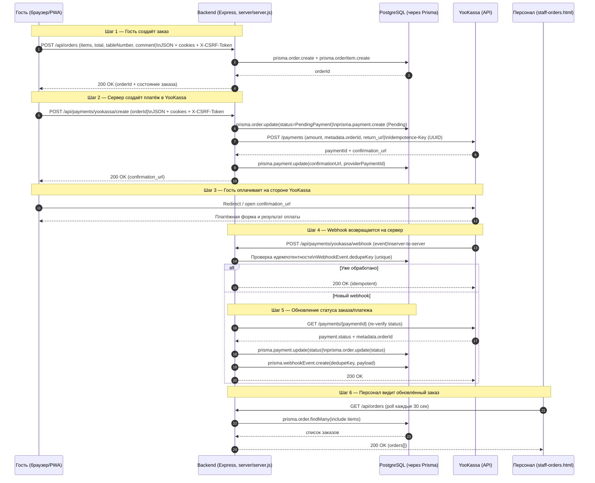

# BRODSKY — Архитектурные диаграммы (Mermaid)

Ниже приведены две диаграммы Mermaid.js для отчёта/ВКР. Они соответствуют реализованной структуре проекта и основным файлам: `index.html`, `script.js`, `staff-orders.html`, `manager.html`, `server/server.js`, `prisma/schema.prisma`, `.env.example`, `package.json`.

---

## Диаграмма 1 — System Architecture (high-level)

**Цель:** показать систему на верхнем уровне по слоям **Presentation → Application → Data → External**, а также выделить «прослойку безопасности» (middleware), которая применяется в backend.

```mermaid
flowchart TB
  %% ===== Layers =====
  subgraph Presentation["Presentation layer (Клиент / UI)"]
    GuestUI["Guest UI\n- Меню/корзина/чекаут\n- Создание заказа и брони\nFiles: index.html + script.js"]
    StaffUI["Staff UI\n- Мониторинг заказов\n- Смена статуса заказов\nFile: staff-orders.html"]
    ManagerUI["Manager UI\n- Просмотр заказов/броней\n- Смена статуса брони\nFile: manager.html"]
  end

  subgraph Application["Application layer (Backend)"]
    API["Express REST API + Static hosting\nFile: server/server.js"]

    subgraph Security["Security layer (middleware)"]
      Helmet["Helmet\nHTTP security headers"]
      CORS["CORS allowlist\n+ credentials cookies"]
      Rate["Rate limiting\n(express-rate-limit)"]
      Sessions["Cookie Sessions\nexpress-session\nStore: connect-pg-simple (PostgreSQL)"]
      CSRF["CSRF protection\ncsurf\nToken endpoint: GET /api/csrf"]
      EnvVal["Env validation\nFile: server/env.js"]
    end

    Payments["Payments module\n- Create payment\n- Verify payment status\n- Webhook handler\n(server/server.js)"]
  end

  subgraph Data["Data layer (Хранение данных)"]
    Prisma["Prisma ORM\nFiles: prisma/schema.prisma\n+ Prisma Client in server/server.js"]
    PG["PostgreSQL\n- Users/Orders/Reservations\n- Payments/WebhookEvents\n- Session table"]
  end

  subgraph External["External services"]
    YK["YooKassa\n- Payments API\n- Webhooks"]
  end

  %% ===== Flows =====
  GuestUI -->|HTTPS (fetch, JSON)| API
  StaffUI -->|HTTPS (fetch, JSON)| API
  ManagerUI -->|HTTPS (fetch, JSON)| API

  API --> Security
  API --> Payments

  API -->|DB queries| Prisma
  Prisma --> PG

  Payments -->|HTTPS| YK
  YK -->|HTTPS webhook| Payments
```

**Пояснение:**
- Клиентская часть — статические страницы, которые обращаются к серверу через `fetch` и получают/отправляют JSON.
- Сервер на Express выполняет роль единого приложения (монолит): API, бизнес-логика, платежная интеграция.
- «Security layer» отражает фактически подключённые меры защиты в `server/server.js`: заголовки, CORS, лимиты, cookie-сессии, CSRF и валидация конфигурации.
- Слой данных представлен PostgreSQL, доступ к которому реализован через Prisma (схема — `prisma/schema.prisma`).
- Внешний платёжный провайдер YooKassa взаимодействует с сервером по HTTPS (создание платежей и webhook-уведомления).

---

## Диаграмма 2 — Data Flow for Order + Payment

**Цель:** пошагово показать поток данных «Заказ → Платёж → Webhook → Обновление статуса → Отображение персоналу».



**Пояснение по шагам (1–6):**
1. **Гость создаёт заказ** через `POST /api/orders`. Сервер сохраняет заказ и позиции в PostgreSQL (модели `Order`, `OrderItem` в `prisma/schema.prisma`).
2. **Создание платежа** инициируется запросом `POST /api/payments/yookassa/create`: сервер формирует запрос к YooKassa, получает `confirmation_url` и возвращает его клиенту. Для заголовка `Idempotence-Key` используется UUID, чтобы избежать повторов.
3. **Оплата** проходит на стороне YooKassa (клиент переходит по `confirmation_url`).
4. **Webhook** приходит на endpoint `POST /api/payments/yookassa/webhook` (server-to-server).
5. **Обновление статусов** выполняется только после повторной проверки состояния платежа через API YooKassa (re-verify), затем обновляются записи в `Payment` и `Order`. Идемпотентность обработки достигается фиксацией события в `WebhookEvent` с уникальным `dedupeKey`.
6. **Персонал** регулярно запрашивает список заказов (polling в `staff-orders.html`) и видит обновлённый статус после записи в БД.

